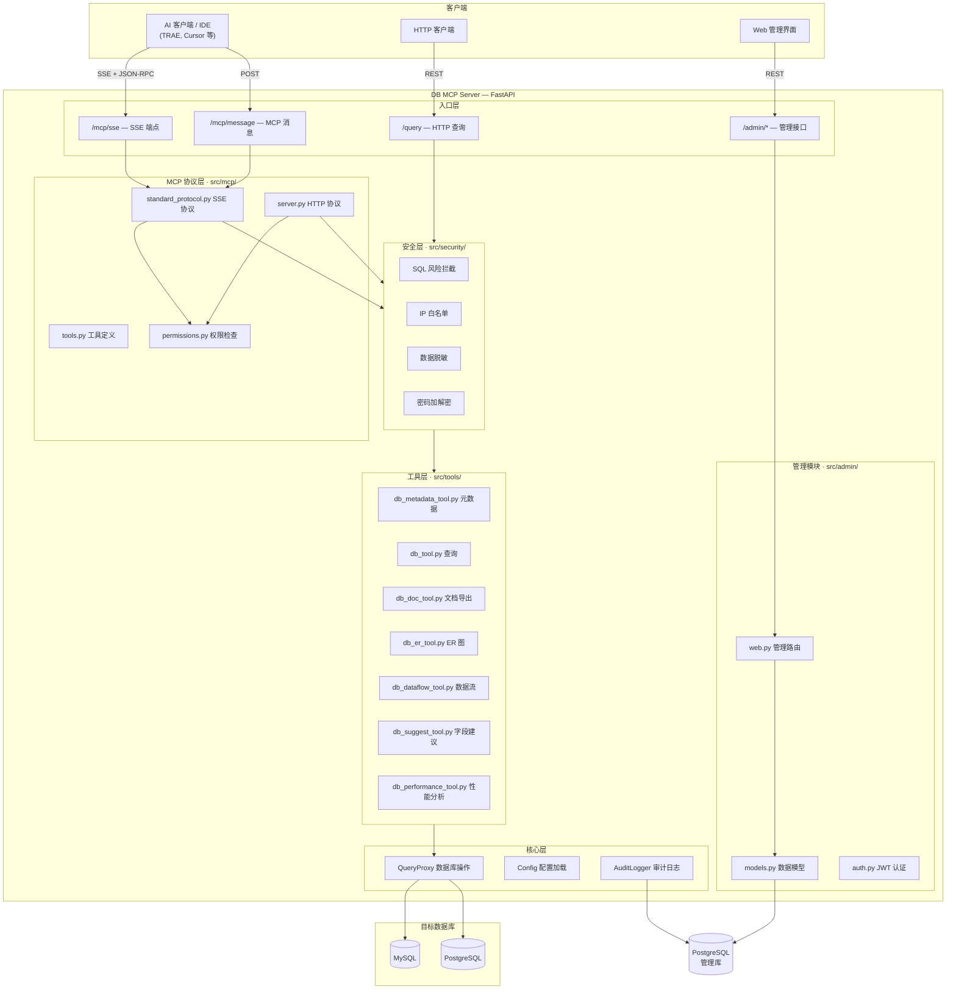

# DB MCP Server

企业级数据库访问代理系统，支持 MySQL 和 PostgreSQL。通过访问密钥、连接级权限控制、IP 白名单与审计日志，提供安全、可审计的数据库访问。所有真实数据库凭证集中管理，客户端无需知道数据库账号密码。

## 项目简介

- 🔐 访问控制：按“访问密钥 × 连接”授权（只读/读写/DDL）
- 🛡️ 安全防护：SQL 风险拦截、IP 白名单、数据脱敏
- 🔄 事务支持：开启/提交/回滚/状态/清理
- 📊 多数据库：支持 MySQL 与 PostgreSQL
- 📡 标准 MCP：提供 HTTP API 与 SSE 标准协议
- 📝 审计日志：完整记录操作与耗时
- 🌐 Web 管理：图形化管理连接、密钥、权限、白名单
- 🐳 Docker 部署：supervisord 管理，非 root 运行

## 架构图



## 快速开始

### 前置要求

- Docker 20.10+
- Docker Compose 1.29+

### 使用 Docker Compose 部署

1. 克隆项目

```bash
git clone https://github.com/redgreat/zr_db_mcp_server.git
cd zr_db_mcp_server
```

2. 配置文件

```bash
cp config/config.yml.example config/config.yml
# 编辑 config/config.yml，至少修改 security.master_key、admin_database 访问参数
```

3. 启动服务

```bash
docker-compose up -d
```

4. 检查服务状态

```bash
docker-compose ps
docker-compose logs -f
```

5. 访问管理界面

浏览器访问: http://localhost:3000/admin

### 手动部署

```bash
# 安装依赖
pip install -r requirements.txt

# 配置文件
cp config/config.yml.example config/config.yml
# 编辑 config/config.yml，设置 master_key 和 PostgreSQL 管理库

# 初始化管理数据库（PostgreSQL）
python scripts/init_admin_db.py

# 启动服务
uvicorn src.server:app --host 0.0.0.0 --port 3000
```

## 配置说明（YAML）

配置文件路径：config/config.yml（示例参见 config/config.yml.example）

关键项：

- server：服务监听地址与端口
- security：主密钥、JWT 密钥、会话超时
- admin_database：PostgreSQL 管理库连接信息（用于存储连接、密钥、权限、审计日志等）
- database：数据库连接池参数
- logging：日志级别、目录、审计日志写入位置

示例片段：

```yaml
server:
  host: 0.0.0.0
  port: 3000

security:
  master_key: change_this_master_key_in_production
  jwt_secret: change_this_jwt_secret_in_production
  session_timeout: 3600

admin_database:
  host: localhost
  port: 5432
  database: zr_db_mcp_admin
  username: dbmcp_admin
  password: change_this_password

logging:
  level: INFO
  dir: logs
  audit_to_database: true
  audit_to_file: false
```

**重要**：生产环境必须使用强随机 master_key，并正确配置 PostgreSQL 管理库。

## 目录结构

```
zr_db_mcp_server/
├── config/              # 配置文件目录
│   └── supervisord.conf # Supervisord 配置
├── scripts/             # 脚本目录
├── src/                 # 源代码目录
│   ├── admin/           # 管理后台模块 (Web/API)
│   ├── db/              # 数据库操作模块
│   ├── security/        # 安全部分（IP 白名单、加密、拦截器等）
│   ├── tools/           # 元数据与工具模块
│   ├── mcp/             # MCP 协议与工具路由
│   ├── config.py        # 配置加载（YAML）
│   ├── server.py        # 服务主文件
│   ├── logging_utils.py # 日志工具
│   └── init_admin_db.py # 管理库初始化脚本（PostgreSQL）
├── data/                # 数据目录（挂载卷）
├── logs/                # 日志目录（挂载卷）
├── Dockerfile           # Docker 镜像构建
├── docker-compose.yml   # Docker Compose 配置
└── requirements.txt     # Python 依赖
```

## 使用指南（连接级权限模型）

### 1. 管理员登录并获取令牌

```bash
curl -X POST http://localhost:3000/admin/login \
  -H "Content-Type: application/json" \
  -d '{ "username": "admin", "password": "admin123" }'
# 返回: { "token": "...", "user": { ... } }
```

> 后续所有 /admin/* 接口都需要在 Header 中携带 Authorization: Bearer <token>

### 2. 创建数据库连接

```bash
curl -X POST http://localhost:3000/admin/connections \
  -H "Authorization: Bearer <token>" \
  -d 'name=主库&host=192.168.1.100&port=3306&db_type=mysql&database=myapp_db&username=db_user&password=SecureP@ss&description=生产环境主库'
```

支持的 db_type：mysql、postgresql。密码会使用 master_key 加密存储。

### 3. 创建访问密钥

```bash
curl -X POST http://localhost:3000/admin/keys \
  -H "Authorization: Bearer <token>" \
  -H "Content-Type: application/json" \
  -d '{ "ak": "api_key_001", "description": "客户端A", "enabled": true }'
```

### 4. 为密钥授权连接与权限级别

```bash
curl -X POST http://localhost:3000/admin/permissions \
  -H "Authorization: Bearer <token>" \
  -d 'key_id=1&connection_id=1&select_only=true&allow_ddl=false'
```

- select_only=true：仅允许只读查询（SELECT/SHOW/DESCRIBE/EXPLAIN）
- allow_ddl=true：允许 DDL（CREATE/DROP/ALTER/TRUNCATE/RENAME）

### 5. （可选）配置 IP 白名单

```bash
curl -X POST http://localhost:3000/admin/whitelist \
  -H "Authorization: Bearer <token>" \
  -d 'key_id=1&cidr=203.0.113.100&description=办公室固定IP'
```

### 6. 客户端执行查询

```bash
curl -X POST http://localhost:3000/query \
  -H "x-access-key: api_key_001" \
  -d 'connection_id=1&sql=SELECT * FROM users LIMIT 10'
```

### 7. 使用 SSE 流式查询

```bash
curl -N "http://localhost:3000/sse/query?connection_id=1&sql=SELECT%20COUNT(*)%20FROM%20users" \
  -H "x-access-key: api_key_001"
```

### 8. 集成 TRAE（标准 MCP 协议）

TRAE MCP 配置示例（Windows）：%APPDATA%/TRAE/mcp_config.json

```json
{
  "mcpServers": {
    "db-mcp-local": {
      "url": "http://localhost:3000/mcp/sse",
      "transport": "sse",
      "headers": {
        "X-Access-Key": "api_key_001"
      }
    }
  }
}
```

调用工具示例（JSON-RPC 请求到 http://localhost:3000/mcp/message）：

```json
{
  "jsonrpc": "2.0",
  "id": "req-1",
  "method": "tools/call",
  "params": {
    "name": "list_connections",
    "arguments": { "search": "" }
  }
}
```

返回中 connections 的数量即为当前密钥可访问的数据库连接数。

## API 文档（摘要）

### 查询与元数据

- POST /query（Headers: x-access-key；Body: connection_id, sql）
- GET /sse/query（Headers: x-access-key；Query: connection_id, sql）
- GET /metadata/tables（Headers: x-access-key；Query: connection_id）
- GET /metadata/table_info（Headers: x-access-key；Query: connection_id, table）

### 事务接口

- POST /transaction/begin（Body: connection_id, txn_id, timeout?）
- POST /transactions/commit（Body: txn_id）
- POST /transactions/rollback（Body: txn_id）
- GET /transaction/status（Query: txn_id）
- GET /transaction/list
- POST /transaction/cleanup

### 管理接口（需 Authorization）

- POST /admin/login、POST /admin/logout、GET /admin/me
- GET/POST/PATCH/DELETE /admin/keys
- GET/POST/DELETE /admin/connections
- GET/POST/DELETE /admin/permissions
- GET/POST/DELETE /admin/whitelist
- GET /admin/audit/logs
- GET /admin（Web 管理界面）

## 安全特性

- SQL 风险拦截：黑名单关键字、注入模式、风险评分
- 密码加密：使用 master_key（Fernet）加密存储数据库密码
- 权限控制：select_only 与 allow_ddl 两级控制
- IP 白名单：绑定到访问密钥，来源限制
- 数据脱敏：查询结果敏感信息脱敏
- 审计日志：记录访问密钥、客户端 IP、SQL、行数、耗时与状态

## 运维指南

### 查看日志

```bash
docker-compose logs
docker exec db_mcp_server cat /var/log/db_mcp_server/web.out.log
docker exec db_mcp_server cat /var/log/db_mcp_server/audit.log
```

### 重启与更新

```bash
docker-compose restart
git pull && docker-compose up -d --build
```

## 开发指南

```bash
# 创建虚拟环境
python -m venv venv
venv\Scripts\activate  # Windows

# 安装依赖
pip install -r requirements.txt

# 初始化管理数据库
python scripts/init_admin_db.py

# 启动开发服务器
uvicorn src.server:app --reload --host 0.0.0.0 --port 3000
```

## 故障排查

- 缺少访问密钥：检查请求 Header x-access-key
- 风险 SQL 拦截：检查语句是否包含危险操作或注入模式
- 权限不足：检查 select_only/allow_ddl 授权是否满足
- 连接失败：核对 host、port、db_type、用户与密码；检查网络与数据库白名单

## 许可证

本项目采用 MIT License

## 技术支持

如有问题请提交 Issue 或联系技术支持团队。
